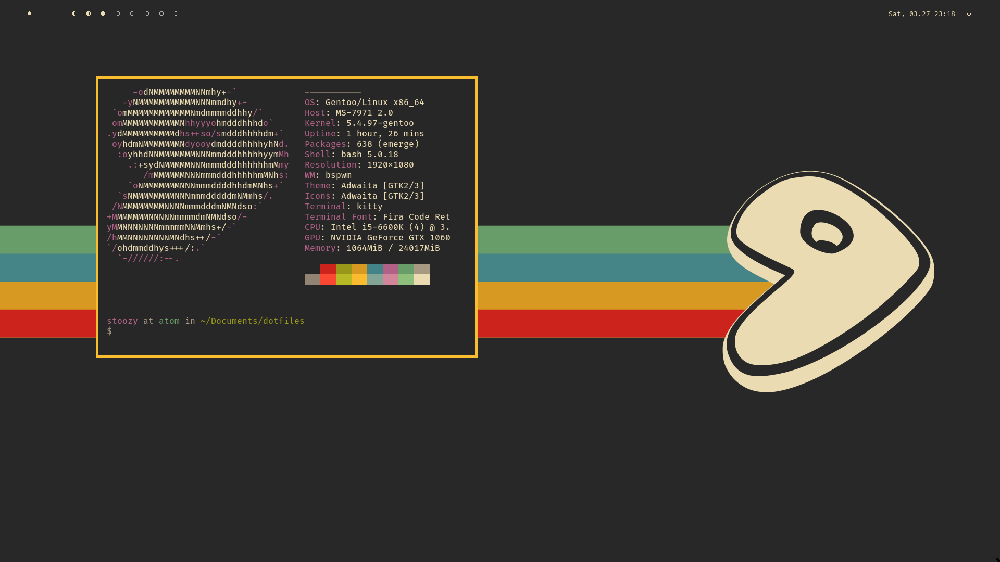

## Welcome to stoozy's dotfiles

A rice I did during winter break. Enjoy!

### How to use

I haven't created a script file or anything. You may just copy the file to corresponding directories/files.

### Firefox

To customize firefox:
- Go to `about:config` and enable this setting `toolkit.legacyuserprofilecustomizations.stylesheets`.  
- Then go to your default profile directory found here `about:profiles` and create a folder called `chrome`. 
- Copy the `userChrome.css` and `userContent.css` files from the firefox directory to the chrome folder you just created. Restart firefox.

### Screenshots

